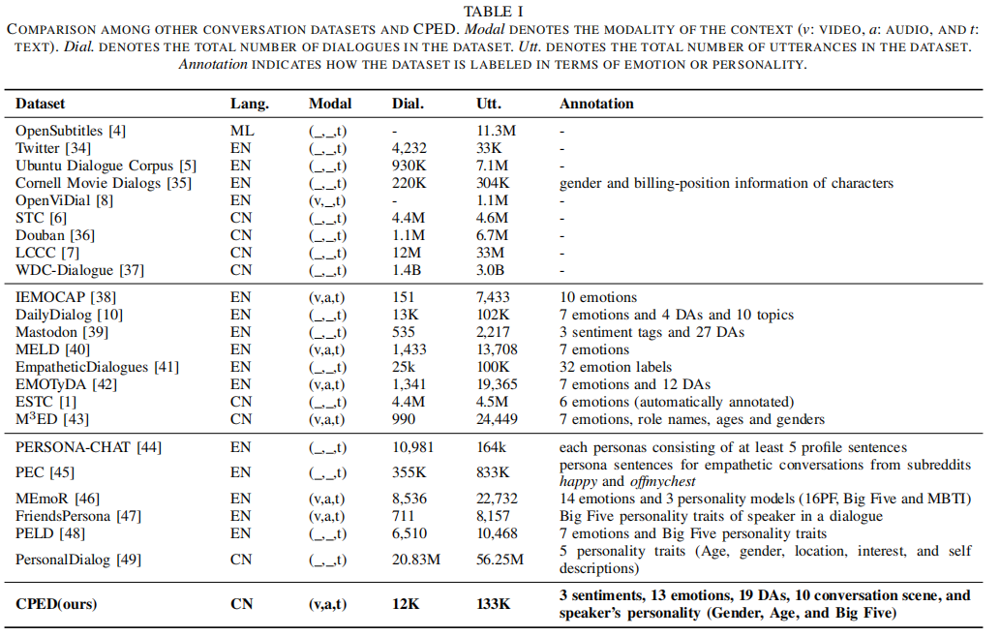
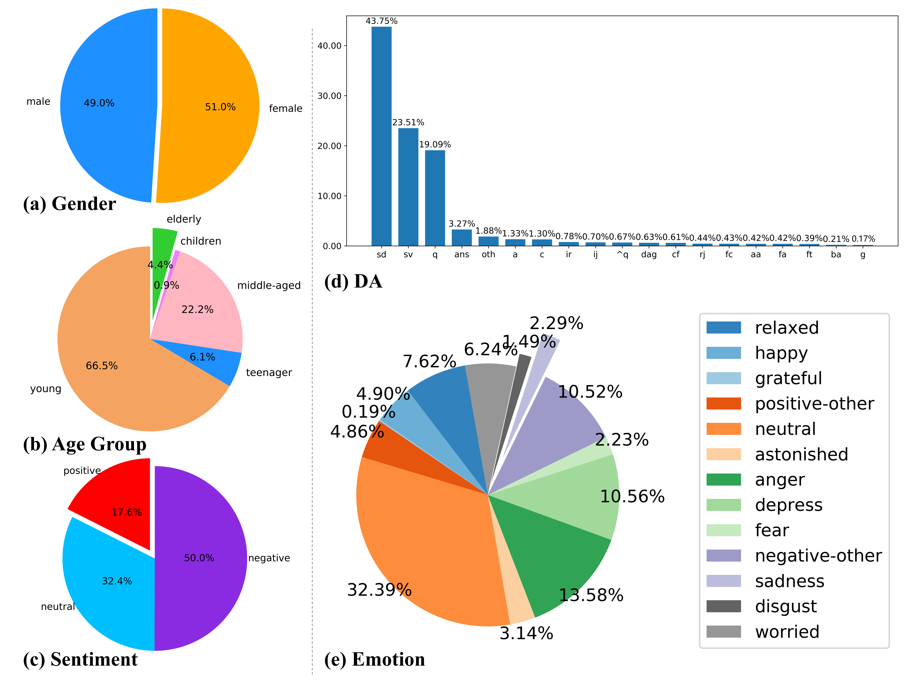

# [CPED](https://github.com/scutcyr/CPED)
[](#python) [](https://arxiv.org/abs/2205.14727) [](https://github.com/scutcyr/CPED/stargazers) [](https://github.com/scutcyr/CPED/blob/main/LICENSE)  [](https://github.com/psf/black)  

    
README: [English](https://github.com/scutcyr/CPED/blob/main/README.md) | [中文](https://github.com/scutcyr/CPED/blob/main/README-zh.md)       
This repository provides the implementation details for the paper:    
**[CPED: A Large-Scale Chinese Personalized and Emotional Dialogue Dataset for Conversational AI](https://arxiv.org/abs/2205.14727)**   

For more information, please refer to our [paper](https://arxiv.org/abs/2205.14727).   

The dataset is also available in luge.ai: [https://www.luge.ai/#/luge/dataDetail?id=41](https://www.luge.ai/#/luge/dataDetail?id=41)

## <a name="#Contents">Contents</a>
* <a href="#Introduction">Introduction</a>
* <a href="#Dataset">Dataset Statistics</a>
* <a href="#Task">Task Definition</a>
* <a href="#Evaluation">Evaluation Results</a>
* <a href="#Usage">Usage</a>

## <a name="#Introduction">Introduction</a>
We construct a dataset named **CPED** from 40 Chinese TV shows. CPED consists of multisource knowledge related to empathy and personal characteristic. This knowledge covers 13 emotions, gender, Big Five personality traits, 19 dialogue acts and other knowledge. The table below shows a comparison of CPED with some other common conversation data sets.

* We build a multiturn Chinese Personalized and Emotional Dialogue dataset called CPED. To the best of our knowledge, CPED is the first Chinese personalized and emotional dialogue dataset. CPED contains 12K dialogues and 133K utterances with multi-modal context. Therefore, it can be used in both complicated dialogue understanding and human-like conversation generation.
* CPED has been annotated with 3 character attributes (name, gender age), Big Five personality traits, 2 types of dynamic emotional information (sentiment and emotion) and DAs. The personality traits and emotions can be used as prior external knowledge for open-domain conversation generation, making the conversation system have a good command of personification capabilities.
* We propose three tasks for CPED: **personality recognition in conversations (PRC)**, **emotion recognition in conversations (ERC)**, and **personalized and emotional conversation (PEC)**. A set of experiments verify the importance of using personalities and emotions as prior external knowledge for conversation generation.



## <a name="#Dataset">Dataset Statistics</a>
In order for the dialogue system to learn emotional expression and personalized expression abilities, we provide multiple types of annotation labels listed in the following Table.

| # of annos. | Labels | Num. |
|:-----------:|:-------|:----:|
| Sentiment | positive, neutral, and negative | 3 |
| Emotion | happy, grateful, relaxed, other-positive, neutral, angry, sad, feared, depressed, disgusted, astonished, worried and other-negative | 13 |
| Gender | male, female, and unknown | 3 |
| Age group | children, teenager, young, middle-aged, elderly and unknown | 6 |
| Big Five | high, low, and unknown | 3 |
| DA | greeting (g), question (q), answer (ans), statement-opinion (sv), statement-non-opinion (sd), apology (fa), command (c), agreement/acceptance (aa), disagreement (dag), acknowledge (a), appreciation (ba), interjection (ij), conventional-closing (fc), thanking (ft), quotation (^q), reject(rj), irony (ir), comfort (cf) and other (oth) | 19 |
| Scene | home, office, school, mall, hospital, restaurant, sports-venue, entertainment-venue, car, outdoor and other-scene | 11 |


Distribution of Gender, Age Group, Sentiment, Emotion and DA in CPED Dataset are shown in the following figure.


 The statistics of CPED are listed in the following table.
| Statistics                      | Train   | Dev     | Test    |
|---------------------------------|---------|---------|---------|
| # of modalities                 | (v,a,t) | (v,a,t) | (v,a,t) |
| # of TV plays                   | 26      | 5       | 9       |
| # of dialogues                  | 8,086   | 934     | 2,815   |
| # of utterances                 | 94,187  | 11,137  | 27,438  |
| # of speakers                   | 273     | 38      | 81      |
| Avg. # utt. per dial.           | 11.6    | 11.9    | 9.7     |
| Max # utt. per dial.            | 75      | 31      | 34      |
| Avg. # of emot. per dial.       | 2.8     | 3.4     | 3.2     |
| Avg. # of DAs per dial.         | 3.6     | 3.7     | 3.2     |
| Avg. utt. length                | 8.3     | 8.2     | 8.3     |
| Max utt. length                 | 127     | 42      | 45      |
| Avg. duration of an utterance   | 2.1s    | 2.12s   | 2.21s   |


## <a name="#Task">Task Definition</a>
CPED allows evaluation of both conversational cognitive tasks and conversation generation tasks, e.g. speaker modeling, personality recognition in conversations, emotion recognition in conversations, DA recognition in conversations, emotion prediction for response, emotional conversation generation, personalized conversation generation, empathetic conversation etc. By being multimodal, CPED can also be applied in multimodal personality or emotion recognition, multimodal conversation generation. It will play a positive role in promoting the development of cognitive intelligence.   
We introduced 3 tasks in the project:   
* **ERC**: [Emotion Recognition in Conversation](https://paperswithcode.com/task/emotion-recognition-in-conversation)
* **PRC**: [Personality Recognition in Conversation](https://paperswithcode.com/task/personality-recognition-in-conversation)
* **PEC**: [Personalized and Emotional Conversation](https://paperswithcode.com/task/personalized-and-emotional-conversation)   


## <a name="#Usage">Usage</a>
You can create the python virtual environment through the following bash script:   
```bash
cd envs # 切换到envs目录
conda env create -n py38_cped --file py3.8_torch1.9.0_ignite0.4.8_tensorflow2.2.0_cuda10.2_transformers4.18.0_paddlepaddle-gpu_2.3.0.yml
```

some version of the used packages are as follows:   
```bash
python=3.8
torch==1.9.0+cu102 
torchvision==0.10.0+cu102 
torchaudio==0.9.0
tensorflow==2.2.0
tensorboard==2.2.2
transformers==4.18.0
paddlepaddle-gpu==2.3.0
paddlenlp==2.3.2
pytorch-ignite==0.4.8
matplotlib==3.5.2
notebook==6.4.11
pandas==1.4.2
chardet==4.0.0
nltk==3.7
bert-score==0.3.11
```


Please cite our paper if you use CPED or this project:    
```
@article{chen2022cped,
	title={{CPED}: A Large-Scale Chinese Personalized and Emotional Dialogue Dataset for Conversational AI},
	author={Yirong Chen and Weiquan Fan and Xiaofen Xing and Jianxin Pang and Minlie Huang and Wenjing Han and Qianfeng Tie and Xiangmin Xu},
	journal={arXiv preprint arXiv:2205.14727},
	year={2022},
	url={https://arxiv.org/abs/2205.14727}
}
```

>>> Engineering Research Ceter of Ministry of Education on Human Body Perception
